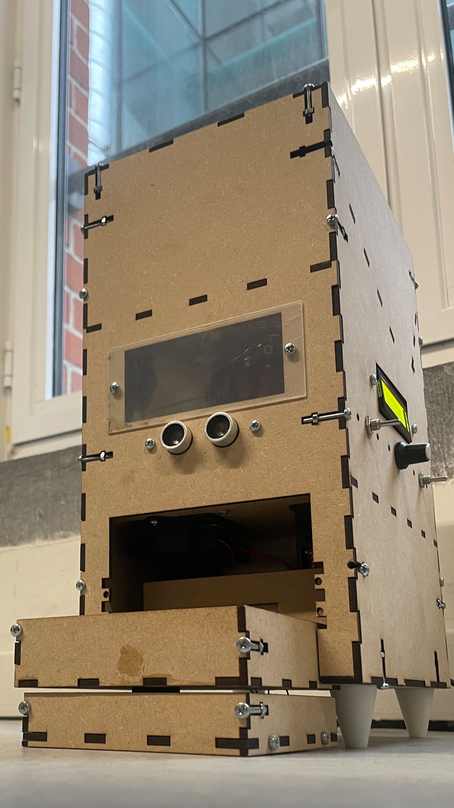

This report describes the design and construction of the prototype of a “Cat Automatic Feeder and Entertainer” carried out in Design Methodology and Mechatronics 1 subjects at VUB as part of the Bruface master of mechantronics at VUB and ULB universities. The idea is simple: building a device that can take care of a cat during a long weekend, taking care of their nutrition and mental health. It will be able to feed the pet the appropriate amount of food at feeding times. In addition, whenever necessary, it will provide an entertaining game to clear the cat's mind. The origin of this idea stems from the lack of a complete product in the market and the need for cat owners to be unconcerned about their cats for a few days. 

The design will consider every possible constraint to achieve all the objectives, such as safety and correct feeding. The building has been developed by laser-cutting for simple and flat parts pieces and 3D printing for more complex ones. The whole design has been carefully designed to consider the space requirements of all components. The materials have been chosen to achieve ecological and functional requirements. 

The electronics and programming subsystems have been implemented in an Arduino Uno, using different modules to take every signal and control the actuators when necessary. Every sensor and motor has been deeply researched to understand the required power supply and code to define the inputs and outputs. 

Every subsystem has been tested before being implemented into the general system. In this way, unique errors can be detected and solved. 
